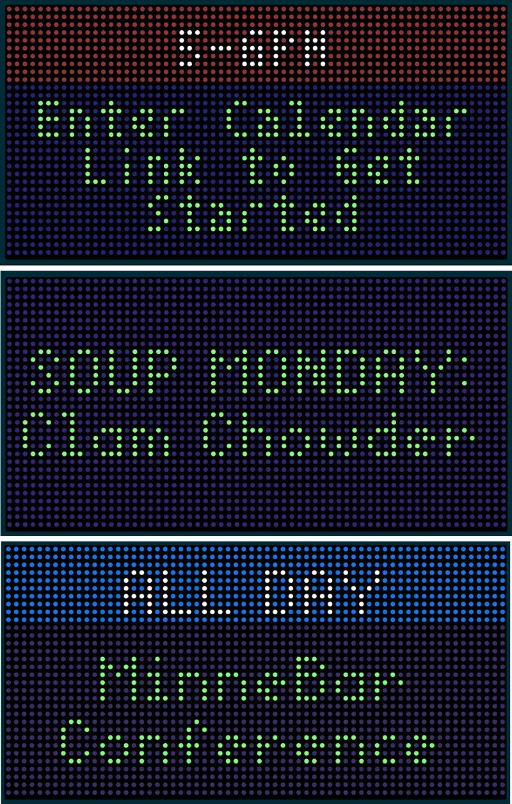

# Google Public Calendar for Tidbyt

This Tidbyt app displays your current Google Calendar events on your Tidbyt device. It works with any iCal URL from Google Calendar, so unlike the official Tidbyt Google Calendar app, you don't need to worry about OAuth authentication and you can use it with any Google Calendar.

This is a great way to display messages, announcements, reminders, and of course meetings and events - all handled through your Google Calendar.

## Features

- Shows only current day's events (today)
- Smart prioritization: current events > all-day events > upcoming events today
- Hides completely when no events are scheduled for today
- Works with iCal URLs from Google Calendar
- Displays event time and title
- Configurable timezone
- Option to show text-only view without time information - perfect for announcements
- Automatic scrolling for long event titles
- Fully customizable colors for time/event backgrounds and text
- Optimized for Tom Thumb font to ensure maximum readability
- Smart marquee that only scrolls for long text
- Centered display formats for better readability
- Properly handles events that cross midnight (e.g., events that start today and end after midnight)

## Event Selection Logic

The app intelligently selects which event to display following this priority:
1. **Current events** - Events happening right now are displayed first
2. **All-day events** - If no current events, displays today's all-day events
3. **Upcoming events** - If no current or all-day events, shows the next event scheduled for today
4. **Hide when empty** - If no events are happening today, the app disappears entirely

## Cross-Midnight Events

The app correctly handles events that span across midnight:
- Events starting today and ending after midnight are displayed properly
- Events remain visible until they actually end, even if that's the next day
- This is particularly useful for tracking events like late meetings, parties, or transportation schedules

## Setup

1. Get an iCal URL from your Google Calendar:
   - Open Google Calendar
   - Find the calendar in the left sidebar
   - Click the three dots next to the calendar name
   - Select "Settings and sharing"
   - Scroll down to "Access permisions for events" and select "Make available to public"
   - Scroll down to "Integrate Calendar"
   - Copy the "Public address in iCal format" - this URL ends with .ics

2. In the Tidbyt app:
   - Add the Google Calendar app
   - Paste your iCal URL into the "Calendar Link" field
   - Set your timezone (defaults to America/New_York)
   - Customize the display options (colors, text-only mode)
   - Save your configuration

## Important Note

This app requires an iCal URL (ending in .ics) and does not work with regular Google Calendar links or HTML links. You have to use the "Public address in iCal format" from your calendar settings, and the calendar must be set to "Public" in the settings.

## Customization Options

### Colors
- **Time Background Color**: Color behind the time display (default: Google Blue)
- **Time Text Color**: Color of the time text (default: White)
- **Event Background Color**: Color behind the event title (default: Black)
- **Event Text Color**: Color of the event title text (default: Light Green)

### Display Modes
- **Regular Mode**: Shows time at the top and event title below
- **Text-Only Mode**: Shows only the event title without time information

## Timezone Handling

The app respects event timezones and displays them according to your configured timezone:

- If an event is in Central Time (e.g., 2-3 PM) and you configure the Tidbyt for Eastern Time, the event will be displayed during 3-4 PM in Eastern Time
- All-day events are displayed as "ALL DAY" throughout the entire day in your configured timezone

## Marquee Scrolling

The app intelligently determines when to scroll text:
- Short event titles are displayed statically and centered
- Longer titles that wouldn't fit on screen are automatically scrolled vertically
- The scrolling behavior is optimized to avoid long blank spaces

## Troubleshooting

If no events appear:
- Make sure your calendar is publicly accessible
- Double-check the URL format
- Verify that you have current or all-day events happening now

If you're experiencing issues:
- Make sure your ICS URL is correct and accessible
- The app displays a clear error message when there are connectivity issues
- The app will indicate when no events are found in the calendar

## Error Handling

The app includes robust error handling:
- Invalid date/time formats are gracefully handled
- Malformed calendar data won't crash the app
- Clear error messages are displayed when issues occur

## Privacy Note

This app only reads publicly accessible calendar data. Do not share sensitive calendar information publicly.